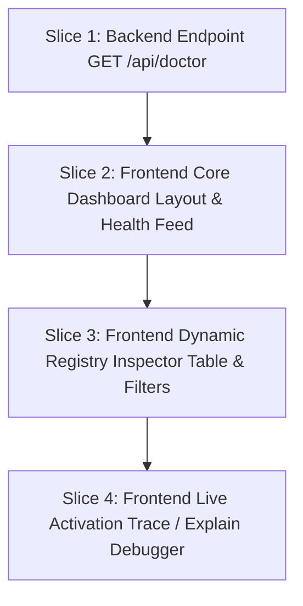

# Phase 10: Dynamic Dashboard & Local API Bridge Implementation Plan

The goal of this phase is to build the interactive **clew Cockpit**—a local, web-based dashboard that connects to our REST API to visualize the composed skill registry, display workspace compatibility diagnostics, and trace recommendation signals.

We divide the work into clean, focused slices to avoid mixing backend changes with frontend changes.

---

## User Review Required

> [!IMPORTANT]
> The backend server runs locally on Node's native `http` module. For the frontend to communicate with it during active development (`npm run dev`), we have already integrated full CORS support. The production bundle is served seamlessly under the same port.

---

## Proposed Slices



---

## Slice 1: Backend Integration (GET /api/doctor)

In this slice, we focus entirely on exposing registry health metrics through the local server.

### Proposed Changes

#### [MODIFY] [server.ts](file:///Users/matt/Workspace/active/clew/packages/clew-cli/src/server.ts)
- Add a new API endpoint route: `GET /api/doctor`.
- Compute and return the full registry health diagnostics, matches, conflicts, and warnings identical to the CLI `doctor` subcommand:
  ```json
  {
    "skills": 12,
    "dbPath": "/path/to/.clew-registry.db",
    "repoSignals": ["typescript"],
    "overlaps": 2,
    "conflicts": [],
    "registryWarnings": [],
    "agentsDiagnostics": [],
    "agentsPreferences": [],
    "warnings": []
  }
  ```

#### [MODIFY] [server.test.ts](file:///Users/matt/Workspace/active/clew/packages/clew-cli/src/server.test.ts)
- Add a test verifying `GET /api/doctor` returns 200 OK and matches the health diagnostic JSON contract.

---

## Slice 2: Frontend - Core Dashboard Layout & Health Feed

In this slice, we implement the responsive dark-mode skeleton and integrate dynamic health metrics.

### Proposed Changes

#### [MODIFY] [Layout.tsx](file:///Users/matt/Workspace/active/clew/packages/clew-dashboard/src/layouts/Layout.tsx)
- Upgrade the main sidebar or layout structure to use modern styling, premium fonts (e.g. Inter/Outfit), subtle border gradients, and interactive hover effects.

#### [MODIFY] [App.tsx](file:///Users/matt/Workspace/active/clew/packages/clew-dashboard/src/App.tsx)
- Replace static cards with active React state fetching from `GET /api/doctor`.
- Render dynamic KPIs: Total Skills, Overlaps, Active Conflicts, and Workspace Signals.
- Display a dedicated **Workspace Diagnostic Warning Feed** pulling in warnings from `warnings` array.

---

## Slice 3: Frontend - Dynamic Registry Inspector

In this slice, we build the skill search, list, and details inspector.

### Proposed Changes

#### [NEW] [RegistryTable.tsx](file:///Users/matt/Workspace/active/clew/packages/clew-dashboard/src/components/RegistryTable.tsx)
- Build a beautiful, responsive data table listing composed skills pulling from `GET /api/registry`.
- Add status pill indicators for active/disabled states.
- Support deep filters: searching by skill ID/name, filtering by layer (system, project, user), and filtering by capability requirements.
- Add detail inspection panels showing raw YAML manifests, capabilities, and tags.

---

## Slice 4: Frontend - Live Activation Trace Debugger

In this slice, we implement the real-time explain/debugger interface.

### Proposed Changes

#### [NEW] [TraceDebugger.tsx](file:///Users/matt/Workspace/active/clew/packages/clew-dashboard/src/components/TraceDebugger.tsx)
- Create a live interactive search bar allowing users to input test queries.
- Fire POST requests to `GET /api/explain` on debounced input.
- Render the **Activation Trace**:
  - Show similarity scores and active/suppressed states clearly.
  - Detail why a skill is suppressed (e.g., "Suppressed by overlay / Redundant with Y").
  - Detail specific signal components (trigger matches, telemetry usage, semantic matches).

---

## Verification Plan

### Backend Slice Verification
- Run `pnpm test` to verify that the new `/api/doctor` endpoint passes automated vitest execution.

### Frontend Slice Verification
- Run `pnpm --filter @clew-ops/dashboard build` to verify Vite transpilation.
- Start the server using `node packages/clew-cli/dist/index.js dashboard --port=7708`.
- Verify in browser that:
  - KPIs load and match actual registry contents.
  - Search and filter controls filter skills correctly.
  - Queries in the debugger successfully run live explanations.
