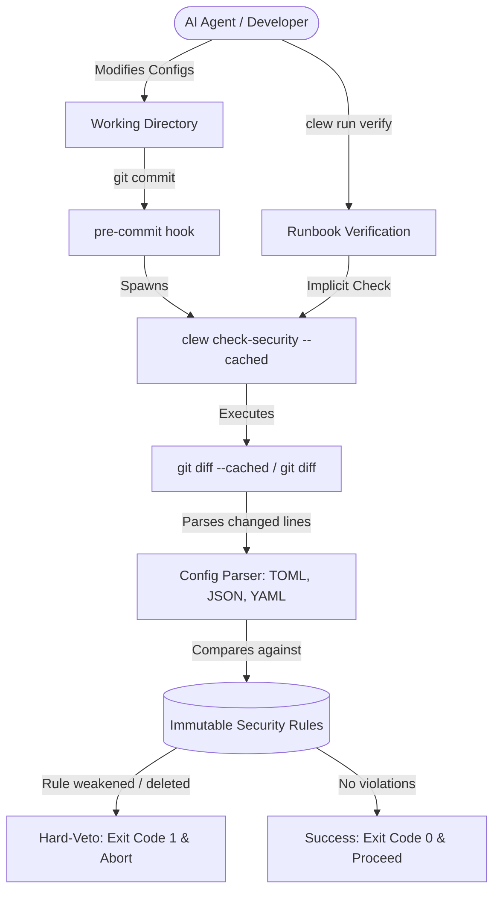

# v0.4: Constitutional Review & Hard-Veto Layer Design Spec

**Status:** Implemented  
**Author:** Antigravity (AI Architect)  
**Date:** 2026-05-29  
**Version:** 0.4.0-draft  

---

## 1. Overview & Goals

As coding agents become more autonomous, they tend to optimize for local code execution speed and test-passing by disabling lint, AST-level checks, or secrets scanning configurations when they hit friction. 

The goal of the **Constitutional Review & Hard-Veto Layer** (v0.4.0) is to implement a strict, deterministic, local-first boundary that hard-vetoes any agent-proposed or developer-accidental change that weakens core security configurations—specifically Ruff's AST security checks, Biome's strict diagnostics, and Gitleaks secrets detection patterns.

### Key Objectives
*   **Zero-Overhead Local Verification:** Run checks in `<100ms` entirely locally without spawning remote LLM calls.
*   **Dual-Verification Gate:** Execute during git pre-commit hooks AND as an automatic implicit step check during `clew run verify`.
*   **100% Deterministic Policy:** Maintain a list of immutable security constraints that cannot be deleted or commented out.
*   **Clear DX Veto Logging:** Output structured, human-centric visual cards when a commit is blocked.

---

## 2. Trigger Architecture



### A. Git Pre-Commit Hook Trigger
The CLI subcommand `clew security install` will write a shell script to `.git/hooks/pre-commit` that executes:
```bash
#!/bin/sh
node packages/clew-cli/dist/index.js check-security --cached
```
If this subcommand returns exit code `1`, Git aborts the commit immediately.

### B. Runbook Verification Hook
Within `@clew-ops/core` `SessionManager.verifyCurrentStep(run.id)`, the verification engine will implicitly spawn a background parser check across the working directory. If a degradation is found, it:
1. Marks the step verification as `failed`.
2. Appends a structured warning envelope with code `active_conflict` to the step verification logs.

---

## 3. Parser Primitives & Immutability Contracts

Instead of raw line-matching, the checker parses configuration files into JSON objects and analyzes deep configuration deltas between the *staged (cached)* files and the current *git head*.

```typescript
export interface SecurityContract {
  file: string;             // File path e.g. "pyproject.toml"
  parser: "toml" | "json" | "yaml";
  rules: {
    path: string[];         // Target configuration array path e.g. ["tool", "ruff", "lint", "ignore"]
    operation: "prevent_inclusion" | "prevent_exclusion";
    blockedValues: string[]; // Specific tokens e.g. ["S", "S101", "S102"]
  }[];
}
```

### Configuration Profiles

#### 1. Python / Ruff (`pyproject.toml`)
*   **Parser:** TOML
*   **Path:** `tool.ruff.lint.ignore` / `tool.ruff.lint.extend-ignore`
*   **Blocked Inclusion:** Any tokens matching `S` rules (e.g. `S102` exec usage, `S101` assert usage).
*   **Path:** `tool.ruff.lint.select`
*   **Blocked Exclusion:** Removing the parent `S` class from selected rules.

#### 2. TypeScript / JS / Biome (`biome.json`)
*   **Parser:** JSON
*   **Path:** `linter.rules.security.noEval` / `linter.rules.security.noConsoleLog`
*   **Blocked Alteration:** Changing the severity level from `"error"` or `"warn"` to `"off"`.

#### 3. Secrets / Gitleaks (`.gitleaks.toml`)
*   **Parser:** TOML
*   **Blocked Deletions:** Deleting active rule definitions.
*   **Blocked Additions:** Modifying `allowlist` paths to include generic parent directories (e.g., wildcards `*` or `src/`).

---

## 4. CLI Output DX & Warnings

When a constitutional veto occurs, the developer is presented with a clear visual card detailing the exact file, path, and violation:

```
✖ [clew security] VETO: Security configuration degraded!
  -------------------------------------------------------------
  File:         pyproject.toml
  Path:         tool.ruff.lint.ignore
  Violation:    Ruff security rule 'S102' (exec usage) was added to the ignore list!
  
  Rationale:    Deactivating AST-based security rules is prohibited by the 
                project's security constitution.
  -------------------------------------------------------------
  ⚠️ Commit aborted. Please restore the security rules and try again.
```

---

## 5. Future Roadmap: Phases v0.5 & v0.6

To complete the full security vision, future release cycles will implement the remaining security pillars:

### Phase v0.5.0: The Skill-Scanner ("Antivirus") Layer
*   **Concept:** Heavily inspired by Cisco's `skill-scanner` repo.
*   **Capabilities:**
    *   *Static Scanning:* A local YARA rule filter checking skill `.yaml` manifests for malicious payloads or insecure configurations before they are imported.
    *   *Behavioral Analysis:* A static AST check ensuring custom skill scripts do not execute arbitrary network fetch commands.
    *   *LLM-as-a-Judge:* Semantic vetting to analyze custom skill instructions for prompt injection vectors.

### Phase v0.6.0: LanceDB Immutable Audit Ledger
*   **Concept:** Implement a local, high-speed vector query ledger for security telemetry.
*   **Capabilities:**
    *   *JSONL Ledger:* Save every command run, MCP call, and query to an immutable `audit.jsonl` log.
    *   *LanceDB Queries:* Vectorize the ledger using local embeddings to perform AI-augmented anomaly scans (e.g. identifying when a subagent starts executing shell operations outside the historical profile of a runbook).
