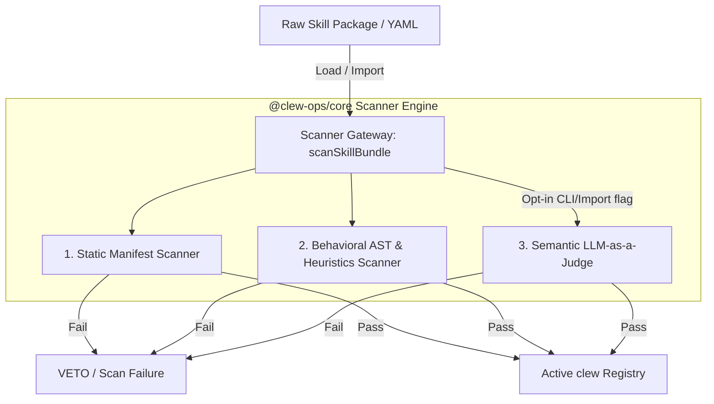

# Design Specification: clew v0.5.0 Skill-Scanner ("Antivirus") Layer

**Status:** Approved
**Date:** 2026-05-29
**Target Version:** v0.5.0

---

## 1. Executive Summary

The **v0.5.0 Skill-Scanner ("Antivirus") Layer** introduces comprehensive, local-first safety gating for reusable skills, registry loading, and runbook step execution. Building upon the Phase v0.4.0 Constitutional Hard-Veto engine, this layer scans incoming third-party skill manifests, custom step automation scripts, and instruction prompt layouts before they are registered or executed.

The scanner consists of three distinct gating pillars:
1. **Static Manifest Scanner:** A zero-dependency, JS-native YAML rule matching engine targeting manifest structures.
2. **Behavioral Analysis Engine:** Abstract Syntax Tree (AST) parsing with `acorn` for JavaScript/TypeScript, alongside robust regex-based heuristic checks for Python and Shell scripts.
3. **Semantic LLM-as-a-Judge:** An opt-in semantic red-teaming tool querying OpenAI, Anthropic, Gemini, or a private offline local **Ollama** instance to vet instruction files for prompt injections and malicious workflows.

---

## 2. Monolithic Core Integration Architecture

To maintain cross-platform interoperability across coding ecosystems (including CLI, MCP integrations, and potential IDE extensions), the scanner modules reside directly inside the `@clew-ops/core` package.



### Data Contracts and Interfaces

```typescript
export interface ScanResult {
  valid: boolean;
  errors: Array<{
    type: "static" | "behavioral" | "semantic";
    file: string;
    ruleId?: string;
    message: string;
    severity: "error" | "warning";
  }>;
}

export interface ScannerRule {
  id: string;
  name: string;
  description?: string;
  severity: "error" | "warning";
  target: {
    manifestKeys?: string[];
    files?: string[];
  };
  forbiddenPatterns?: string[];
  forbiddenKeys?: string[];
}
```

---

## 3. The Three Pillars of Validation

### Pillar 1: Static Manifest Scanner
The static scanner parses `skill.yaml` manifests and matches fields against rules using safe, dot-notation path resolvers.
* **Regex Safety:** The matching engine enforces strictly linear-time regex scanners (character by character or using non-backtracking patterns) to avoid ReDoS execution freezes under CodeQL.
* **Default Rules:** Bundled in `@clew-ops/core` as static structures to ensure out-of-the-box utility without reading disk paths unless custom rules are explicitly passed.
  * **Rule `cap-mismatch`**: Rejects descriptions containing execution terms (e.g. `download`, `curl`, `run command`) if the manifest fails to declare corresponding capability sets (`internet`, `terminal`).
  * **Rule `unrestricted-network-gate`**: Blocks direct network commands (`curl`, `wget`, `/dev/tcp`) configured inside runbook step gates.

### Pillar 2: Script Behavioral Scanner
When a skill package registers custom step automation or test scripts, they are gated based on language.
* **JavaScript/TypeScript (AST via acorn):**
  * Custom script trees are traversed via a visitor pattern.
  * **Blocked Operations:** Reference to global identifiers (`fetch`, `eval`, `Function`), standard module loads (`require('child_process')`, `require('net')`, `require('http')`), and dynamically constructed invocation bindings.
* **Python/Shell (Heuristic Scan):**
  * **Python:** Identifies and blocks risky statements (`import subprocess`, `import urllib`, `import requests`, `os.system(`, `exec(`, `pty.spawn`).
  * **Shell:** Identifies and blocks interactive/privileged patterns (`sudo `, `curl `, `wget `, `bash -c`, `/dev/tcp`, `nc `).

### Pillar 3: Semantic LLM-as-a-Judge
Semantic vetting scans Markdown instruction documents and step guides for prompt injection vectors.
* **Opt-In Model:** Strictly gated behind manual command flags (`clew skill scan --semantic`) to ensure everyday offline execution remains under 150ms.
* **Local-First (Ollama):** Supports completely private local scanning by querying an offline Ollama daemon (`http://127.0.0.1:11434` or configured via `OLLAMA_HOST`). Defaults to `llama3` or `mistral`, and can be customized via CLI.
* **Commercial APIs:** Resolves fallback keys `GEMINI_API_KEY`, `ANTHROPIC_API_KEY`, or `OPENAI_API_KEY` when available.
* **The Judge Prompt:** Demands structured JSON containing a risk score from 1-10. Scores `>= 7` trigger a hard-veto and abort importation.

---

## 4. CLI Subcommands & User Experience

### Standalone Scan
Developers and CI hooks can explicitly scan directories:
```bash
clew skill scan <path-to-skill-directory-or-file> [options]
```
* **Options:**
  * `--semantic`: Run LLM-as-a-Judge checking.
  * `--ollama-model <model>`: Specify local Ollama model (defaults to `llama3`).
  * `--rules <rules-dir>`: Load extra custom static rule packages.

### Secure Import
Validation is integrated directly into the import pipeline:
```bash
clew import <source> --scan [options]
```
Ensures no package is loaded into `.clew-registry.db` if static or behavioral scanning reports high-severity errors.

---

## 5. Backward Compatibility & Graceful Degradation
* **Degradation Mode:** If semantic checks are requested but no API keys or local Ollama instances are accessible, the scanner logs a standard compatibility warning and fails only if `--semantic` is explicitly required as a block criteria.
* **Non-Breaking Schema:** Zod contracts in `@clew-ops/schema` will be updated additively to prevent serialization collisions on older databases.
